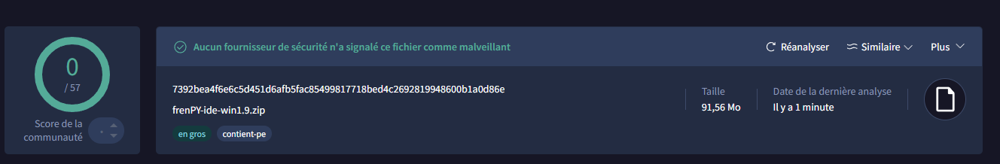

### frenPY IDE

## introduction :

frenPY ide est une application qui permet de compiler, de coder et d'éxécuter des .frenpy

## Installation

Pour installer frenpy IDE, vous devez :
- Télécharger la dernière version à cette adresse : [ICI](https://github.com/slohwnix/frenPY-ide/releases/download/release1.9/frenPY-ide-win1.91.zip)
- Extrayer le .zip téléchargé précédemment
- Lancer le main.exe

 # Dépannages :

  ### **Pourquoi Le main.exe n'est pas dans le zip ?**
  
Si le fichier main.exe n'est pas dans le fichier zip, le fichier a surrement été détecté comme virus par votre antivirus, si ça vous arrive :

- Récupérer le chemin d'accès au dossier ou vous avez extrait le fichier .zip,
- éxécuter cmd.exe, et éxécuter cette commande, en remplacant [votre chemin] par le chemin d'accès récupéré plus tôt :
  ```batch
  cd [votre chemin]
  ```
- Une fois, cette commande éxécuté, éxécuter cette commande :
  ```batch
  .\python\Scripts\pip.exe install pyqt6 frenpy
  .\python\Scripts\pip.exe install pyqt6 frenpy --upgrade
  ```
- Une fois l'environnement configuré éxécuter :
  ```batch
  .\python\python.exe .\scripts\update.py
  .\python\python.exe .\scripts\frenpy_ide.py
  ```
## Sécurité :
Frpy-ide ne possède pas de virus, pour vous le prouvez, nous avons fait un test sur virustotal :


https://www.virustotal.com/gui/file/7392bea4f6e6c5d451d6afb5fac85499817718bed4c2692819948600b1a0d86e


## crédits :
   Pyqt6 -> QT group
   
   Python-> Python Software Foundation


